# wakiliDesk Technical Architecture

This document explains the current wakiliDesk MVP architecture, framework choices, module boundaries, runtime flows, API surface, and deployment design.

## 1. Architecture Summary

wakiliDesk is a Django-based multi-tenant records and file management system for law firms. The MVP uses server-rendered Django templates, PostgreSQL for relational data, Redis for Celery task brokering, Docker Compose for local/staging runtime, and GitHub Actions for VPS deployments.

The current design is intentionally modular but monolithic. Each business capability lives in a Django app with explicit tenant checks and shared service helpers. This keeps the MVP deployable on a small VPS while preserving a path to split high-load services later if needed.

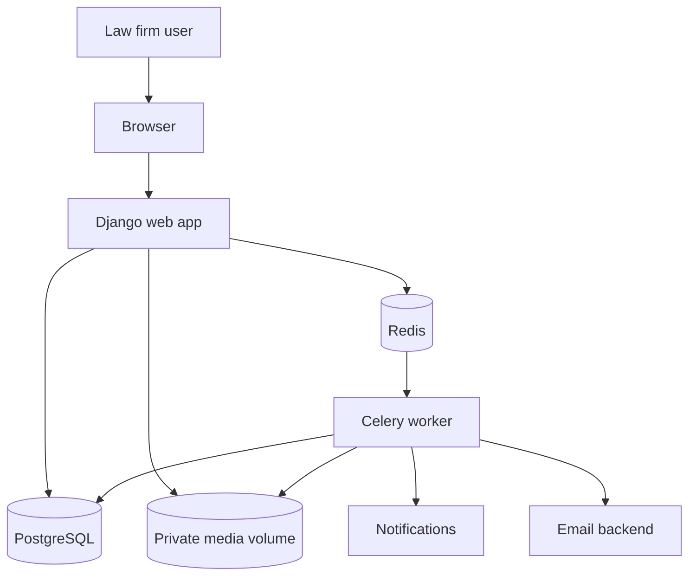

## 2. Framework and Runtime Choices

| Area | Choice | Reason |
| --- | --- | --- |
| Web framework | Django | Strong admin, auth, forms, ORM, migrations, and server-rendered workflows for admin-heavy legal operations. |
| UI | Django templates and inline CSS | Keeps MVP simple, fast to deploy, and easy to operate without a frontend build pipeline. |
| Database | PostgreSQL | Reliable relational storage, good indexing, future full-text search path. |
| Background jobs | Celery | Clear boundary for OCR/text extraction and reminder processing. |
| Broker/cache | Redis | Standard lightweight Celery broker for Docker deployments. |
| File storage | Private local media paths | MVP-safe tenant-aware storage abstraction; can later move to S3/MinIO signed URLs. |
| Deployment | Docker Compose | Consistent local and VPS execution without host-level Python setup. |
| Static files | WhiteNoise | Simple static serving inside Gunicorn container for staging. |
| CI/CD | GitHub Actions over SSH | Push-to-master deployment to shared VPS without giving Actions sudo access. |

## 3. Application Modules

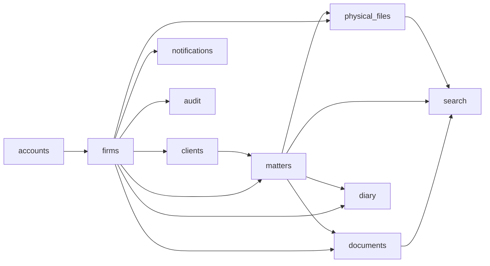

| App | Responsibility |
| --- | --- |
| `accounts` | Custom email-based user model, signup, invitation acceptance, development seeding. |
| `firms` | Tenant model, firm membership, roles, permissions, firm profile, current firm middleware, dashboard. |
| `clients` | Firm-scoped client records and client numbering. |
| `matters` | Matters, practice areas, matter parties, confidentiality policy, matter numbering. |
| `documents` | Document metadata, document versions, private file storage, archive/restore, download, OCR task boundary. |
| `physical_files` | Paper file registry, storage locations, checkout/check-in, digitisation review. |
| `diary` | Court diary events, month calendar, reminder records, reminder task/command. |
| `notifications` | In-app notifications and read/unread state. |
| `search` | Tenant-scoped global search across permitted records. |
| `audit` | Tenant-scoped audit event records for important actions. |
| `common` | Shared simple endpoints such as `/health/`. |

## 4. Request Flow

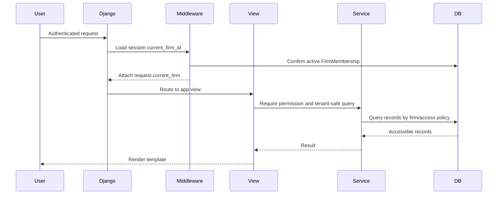

Key rule: tenant filtering happens server-side. Views must use service helpers such as `matters_visible_to_user`, `documents_visible_to_user`, `physical_files_visible_to_user`, and `diary_events_visible_to_user`.

## 5. Multi-Tenancy and Access Control

wakiliDesk uses a shared database and shared schema. Tenant ownership is represented by a direct `firm` foreign key on tenant-owned records.

Access is granted through `FirmMembership`, not by tying a user permanently to one firm. This allows a user to belong to multiple firms while keeping each request scoped to one active firm.

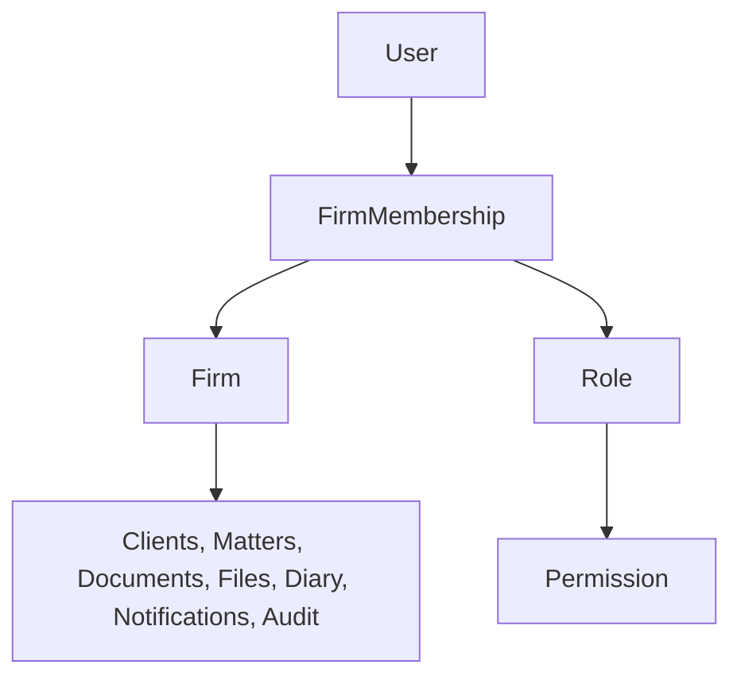

Access layers:

1. Authentication: user must be signed in.
2. Firm selection: `CurrentFirmMiddleware` resolves `request.current_firm`.
3. Permission checks: `require_firm_permission` checks the active membership role.
4. Tenant filtering: querysets filter by `firm`.
5. Confidentiality filtering: restricted matter-linked records are hidden unless the user has `manage_confidential_matter` or is assigned to the matter.

## 6. Core Data Model

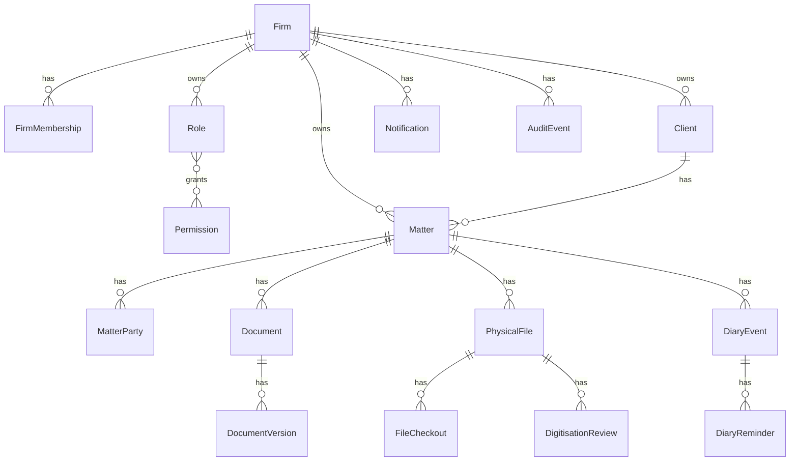

Important model decisions:

- `Firm.slug` identifies demo/test firm domains and human-friendly references.
- `Firm.file_number_pattern` controls matter number formatting.
- `Firm.accent_color` and `Firm.logo` support white labeling.
- `Matter.confidentiality_level` controls access inheritance for documents, physical files, diary events, search, and dashboard metrics.
- `DocumentVersion` is immutable from a versioning perspective; new uploads create new versions.
- `DiaryReminder` has `PENDING`, `SENT`, and `FAILED` states to keep reminder processing idempotent.

## 7. Main User Workflows

### Firm Onboarding

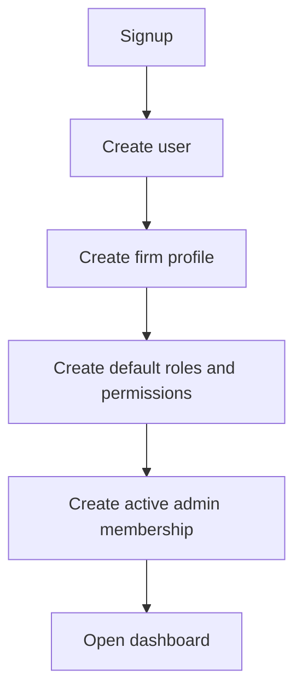

### Matter and Document Flow

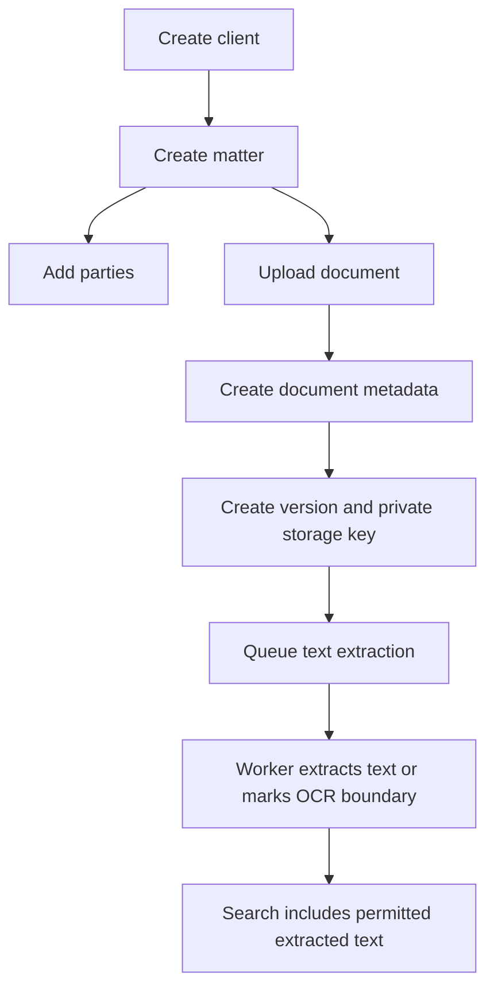

### Physical File and Digitisation Flow

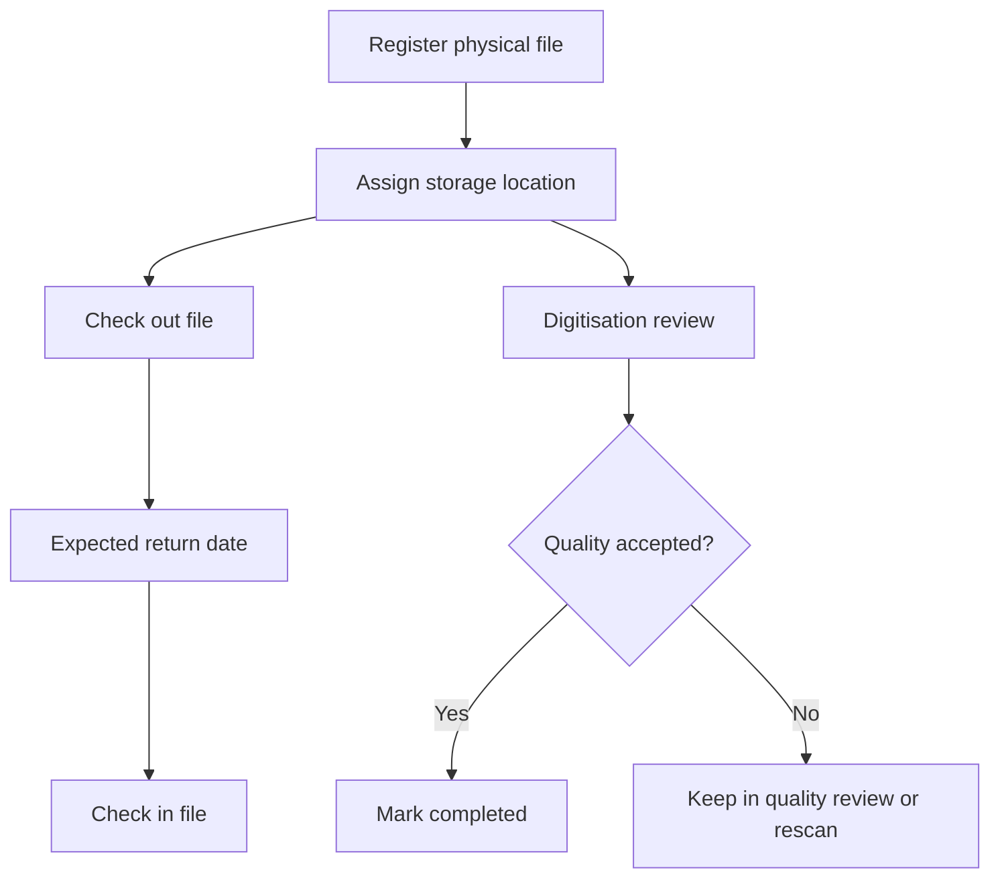

### Diary and Reminder Flow

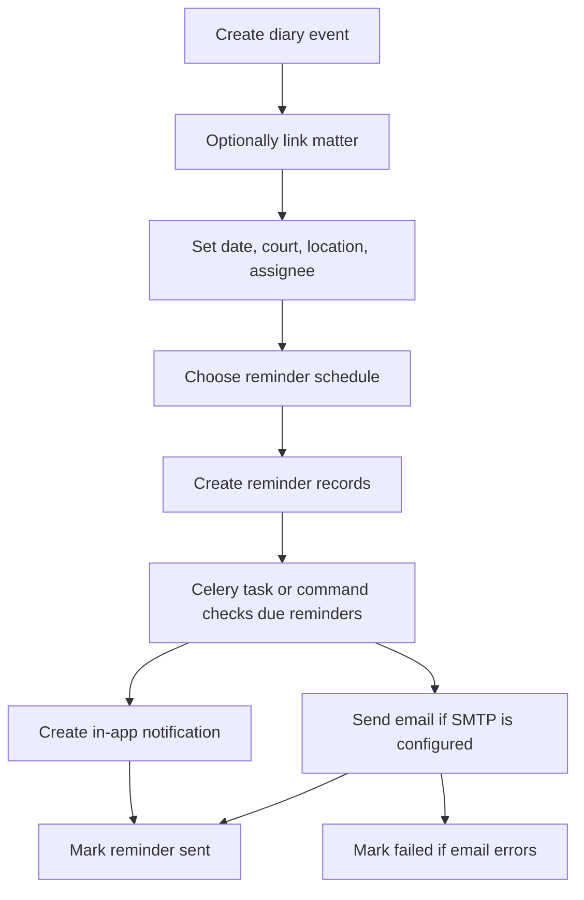

## 8. HTTP Route Surface

The MVP is primarily server-rendered HTML. It does not expose a public REST API yet.

| Area | Routes |
| --- | --- |
| Health | `/health/` |
| Auth | `/accounts/login/`, `/accounts/logout/`, `/accounts/signup/`, `/accounts/invitations/<token>/accept/`, `/accounts/switch-firm/<firm_id>/` |
| Dashboard/Firm | `/`, `/onboarding/firm/`, `/app/firm/profile/`, `/app/firms/<firm_id>/` |
| Administration | `/app/administration/users/`, `/app/administration/users/invite/`, `/app/administration/roles/` |
| Clients | `/clients/`, `/clients/new/`, `/clients/<client_id>/`, `/clients/<client_id>/edit/` |
| Matters | `/matters/`, `/matters/new/`, `/matters/<matter_id>/`, `/matters/<matter_id>/edit/`, `/matters/<matter_id>/parties/new/` |
| Practice Areas | `/matters/practice-areas/`, `/matters/practice-areas/new/`, `/matters/practice-areas/<area_id>/edit/` |
| Documents | `/documents/`, `/documents/upload/`, `/documents/<document_id>/`, `/documents/<document_id>/edit/`, `/documents/<document_id>/download/`, `/documents/<document_id>/reprocess-ocr/` |
| Document Categories | `/documents/categories/`, `/documents/categories/new/`, `/documents/categories/<category_id>/edit/` |
| Physical Files | `/physical-files/`, `/physical-files/new/`, `/physical-files/<physical_file_id>/`, `/physical-files/<physical_file_id>/checkout/`, `/physical-files/<physical_file_id>/checkin/` |
| Digitisation | `/physical-files/digitisation/`, `/physical-files/<physical_file_id>/digitisation/review/` |
| Storage Locations | `/physical-files/locations/`, `/physical-files/locations/new/`, `/physical-files/locations/<location_id>/edit/` |
| Diary | `/diary/`, `/diary/calendar/`, `/diary/new/`, `/diary/<event_id>/`, `/diary/<event_id>/edit/`, `/diary/<event_id>/delete/` |
| Notifications | `/notifications/`, `/notifications/<notification_id>/read/` |
| Search | `/search/` |

API-like behavior:

- `/health/` returns JSON for uptime checks.
- `/app/firms/<firm_id>/` returns JSON for a firm detail lookup after membership authorization.

Future API direction:

- Add Django REST Framework only when external clients, mobile apps, or integrations require stable JSON APIs.
- Use versioned paths such as `/api/v1/...`.
- Keep tenant and confidentiality policy in shared services, not only view classes.

## 9. Background Jobs

Celery currently handles task boundaries that should not block web requests.

| Task | Entry point | Purpose |
| --- | --- | --- |
| Document text extraction | `documents.tasks.extract_text_for_version` | Extract plain text and mark PDFs/images for future OCR expansion. |
| Diary reminders | `diary.tasks.send_diary_reminders` | Send due in-app and email reminders. |

Manual commands:

```bash
python manage.py seed_dev
python manage.py send_diary_reminders
```

In the current MVP, periodic scheduling is not yet configured. Reminder processing can be triggered manually, by a cron command, or by adding Celery Beat later.

## 10. Storage Design

Document uploads are stored under private tenant-aware paths below `MEDIA_ROOT/private`.

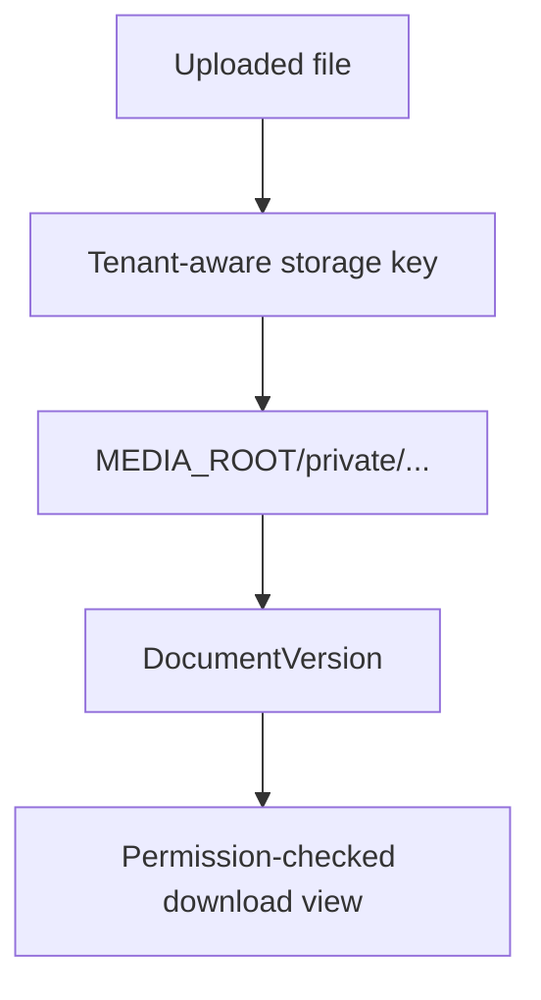

The file path is not exposed directly to users. Downloads go through Django views that enforce document permissions and matter confidentiality.

Production hardening path:

- Move legal documents to S3-compatible object storage.
- Store private object keys in `DocumentVersion.storage_key`.
- Generate signed download URLs or stream through permission-checked views.
- Add virus scanning and file type validation before pilot production use.

## 11. Search Design

Search is tenant-scoped and confidentiality-aware. It currently uses database filtering across clients, matters, matter parties, documents, extracted text, and physical files.

Design tradeoff:

- Current approach is simple and adequate for MVP testing.
- PostgreSQL full-text search should be introduced when larger document volumes make ranking and indexing necessary.

## 12. Notification and Email Design

Notifications are stored as firm-scoped, user-specific records with unread/read status.

Email reminders use Django email settings:

```text
EMAIL_BACKEND
EMAIL_HOST
EMAIL_PORT
EMAIL_USER
EMAIL_PASSWORD
EMAIL_USE_TLS
DEFAULT_FROM_EMAIL
```

Default local/staging-safe behavior uses the console backend. Gmail SMTP can be enabled with a Gmail app password when available.

## 13. Deployment Architecture

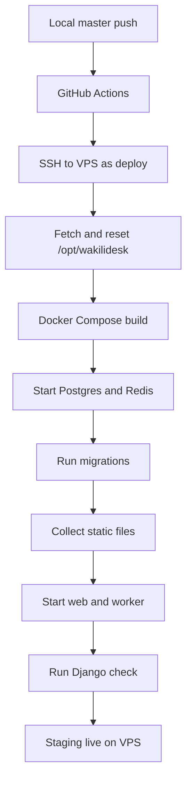

VPS runtime:

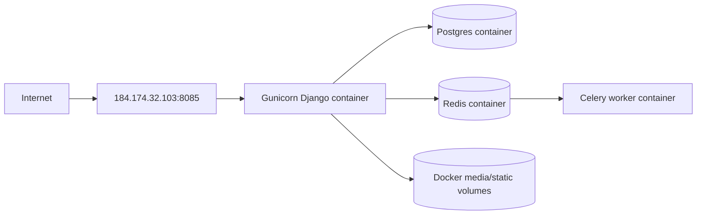

Direct-IP staging uses:

```text
WAKILIDESK_HOST_BIND=0.0.0.0
WAKILIDESK_HOST_PORT=8085
```

Nginx/domain staging should use:

```text
WAKILIDESK_HOST_BIND=127.0.0.1
```

Then Nginx proxies traffic to `http://127.0.0.1:8085`.

## 14. Security and Data Protection

Current controls:

- Email/password authentication.
- Firm-scoped roles and permissions.
- Server-side tenant filtering.
- Matter confidentiality inheritance.
- Private file paths behind permission-checked download views.
- Audit records for important changes.
- `.env` and `.env.prod` excluded from source control.
- Production-like `DJANGO_DEBUG=false` staging configuration.

Known hardening still needed:

- Enforce HTTPS with a real staging/production domain.
- Add password reset and account recovery workflows.
- Add rate limiting and login throttling.
- Add S3-compatible private object storage with signed access.
- Add backup restore drills and automated backup retention.
- Add structured application logging.
- Add Celery Beat or cron for scheduled reminders.
- Add richer audit review UI.

## 15. Design Principles

- Keep tenant boundaries explicit and boring.
- Prefer service helpers for shared access policy instead of duplicating filters in views.
- Keep the MVP monolith until operational pressure justifies service extraction.
- Keep legal document access behind server-side permission checks.
- Preserve simple server-rendered workflows for staff-heavy back-office use.
- Add integrations only after API availability is confirmed.

## 16. Future API and Integration Roadmap

Priority candidates:

1. E-filing/Judiciary integration after API access is confirmed.
2. Calendar export or sync once diary workflows stabilize.
3. S3-compatible storage and signed downloads.
4. Full OCR for PDFs/images.
5. PostgreSQL full-text search.
6. Client portal.
7. Billing, trust accounting, M-Pesa, and eTIMS.

