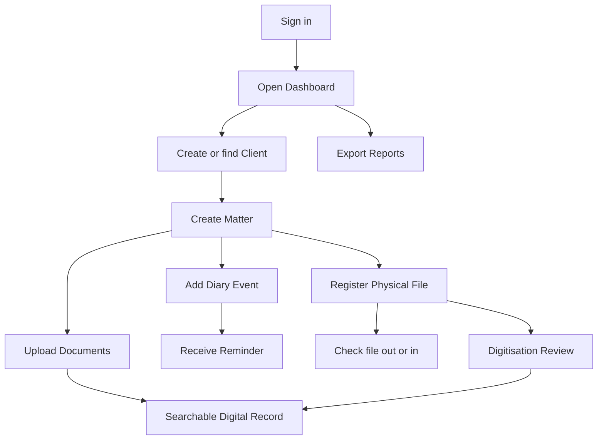
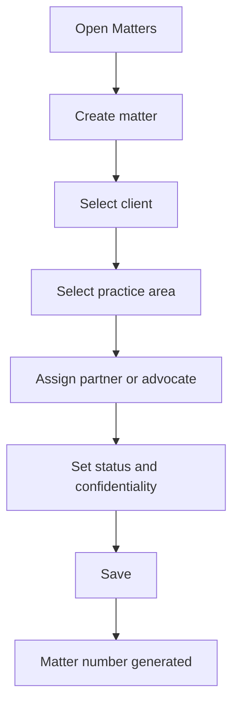
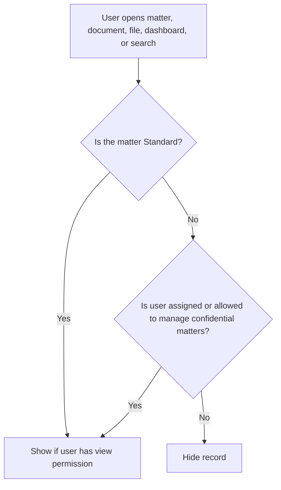
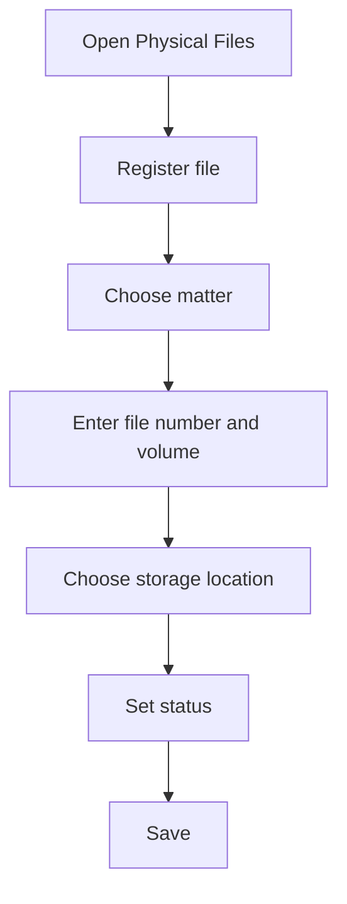
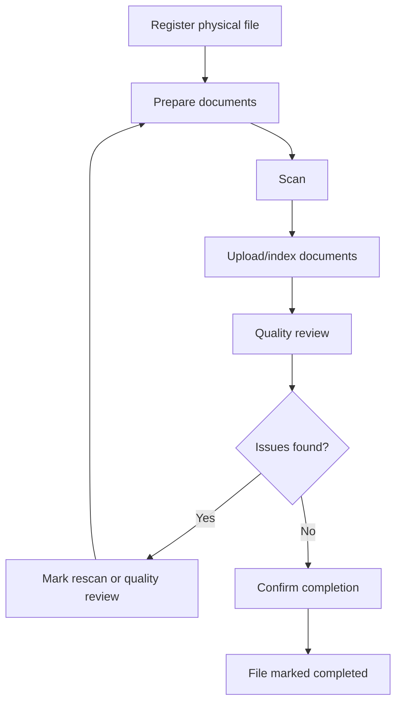
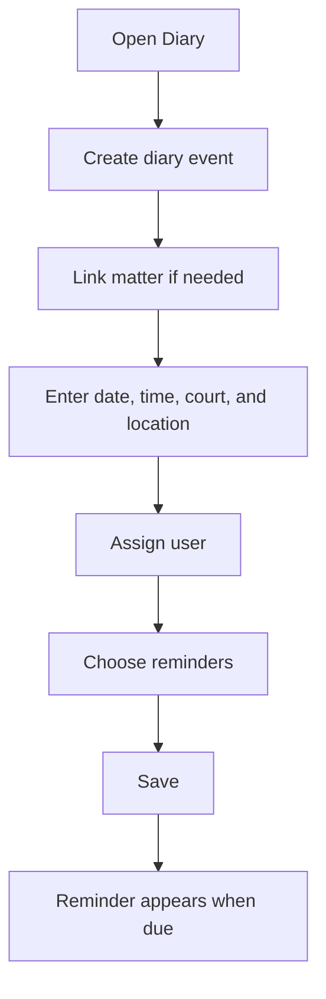

# wakiliDesk End User Manual

This guide is for law firm staff using wakiliDesk in day-to-day work. It avoids technical setup details and focuses on how to use the system.

The hosted version of this guide is available at `/documentation/` on the wakiliDesk site.

## 1. What wakiliDesk Does

wakiliDesk helps a law firm manage digital and physical legal files in one place.

Use it to:

- Register clients.
- Open matters.
- Add parties to matters.
- Upload and find documents.
- Track physical files.
- Check files out and back in.
- Monitor digitisation work.
- Track court dates, filing deadlines, meetings, and reminders.
- Search firm records.
- Export reports.
- Receive filing and processing notifications.
- Control access to confidential matters.

## 2. Main Areas

After signing in, the left navigation gives access to:

- **Dashboard**: summary of matters, documents, files, digitisation, and notifications using the firm's theme color.
- **Clients**: client records.
- **Matters**: legal files or case files.
- **Documents**: uploaded document records and versions.
- **Physical Files**: paper file register and movement tracking.
- **Digitisation**: scanning and quality review tracking.
- **Diary**: court dates, filing deadlines, meetings, reminders, and a month calendar.
- **Search**: firm-wide search across permitted records.
- **Reports**: export clients, matters, documents, physical files, and diary events.
- **Notifications**: messages that need attention.
- **Users, Roles, Firm Profile**: administration areas for authorised users.

## 3. Common Workflow Overview

## 4. Signing In

1. Open the wakiliDesk sign-in page.
2. Enter your email address.
3. Enter your password.
4. Select **Sign in**.

After signing in, you will see the dashboard for your current firm.

If your account belongs to more than one firm, use the firm switch option on the dashboard to move between firms.

## 5. Dashboard

The dashboard gives a quick picture of current filing activity.

You can see:

- Active matters.
- Total documents.
- Physical files currently checked out.
- Files awaiting return.
- Files awaiting quality review.
- Upcoming diary events.
- Past scheduled diary events needing follow-up.
- Unread notifications.
- Digitisation progress.

Use the quick action links to create a client, create a matter, upload a document, register a physical file, or add a diary event.

Dashboard numbers only include records you are allowed to view.

## 6. Clients

A client is the person or organisation the firm acts for.

### Create a Client

1. Open **Clients**.
2. Select **Create client**.
3. Choose whether the client is an individual or organisation.
4. Enter the client name and contact details.
5. Add optional identifiers only when needed.
6. Save.

After saving, wakiliDesk assigns a client number automatically.

### Find a Client

1. Open **Clients**.
2. Scan the list or use **Search**.
3. Open the client record.

From a client page, you can review the client's matters.

## 7. Matters

A matter is the main legal file. It links the client, legal work, documents, parties, and any physical file.

### Create a Matter

1. Open **Matters**.
2. Select **Create matter**.
3. Choose the client.
4. Enter the matter title and description.
5. Choose the practice area.
6. Assign the responsible partner or advocate if known.
7. Choose the status.
8. Choose the confidentiality level.
9. Save.

wakiliDesk generates the matter number automatically.

### Add Parties to a Matter

Matter parties are people or organisations connected to a matter, such as opposing parties, witnesses, directors, or interested parties.

1. Open the matter.
2. Select **Add party**.
3. Choose the party type.
4. Enter the name and contact details.
5. Save.

## 8. Confidentiality

Confidentiality controls who can see sensitive matters and linked records.

The available levels are:

- **Standard**: visible to users with normal view permission.
- **Restricted**: visible only to assigned users or users allowed to manage confidential matters.
- **Partner only**: intended for sensitive partner-level matters.
- **Custom**: reserved for special handling.

Documents and physical files follow the confidentiality of their linked matter. A document cannot be made less confidential than the matter it belongs to.

## 9. Documents

Documents are uploaded files with searchable metadata and version history.

Examples:

- Client instructions.
- Pleadings.
- Court documents.
- Correspondence.
- Evidence.
- Agreements.
- Research notes.
- Internal notes.

### Upload a Document

1. Open **Documents**.
2. Select **Upload document**.
3. Choose the matter.
4. Enter the title, category, date, reference number, and description.
5. Choose the document source.
6. Choose the confidentiality level.
7. Attach the file.
8. Save.

The system stores the document and creates the first version.

### Add a New Version

Use a new version when a document is revised or replaced but should remain part of the same document record.

1. Open the document.
2. Select **Upload new version**.
3. Attach the revised file.
4. Save.

Older versions are preserved.

### Download a Document

1. Open the document.
2. Select **Download current version**.

You must have permission to download documents and access the linked matter.

### Archive or Restore a Document

Archive a document when it should no longer appear as an active document. Restoring makes it active again.

Archiving does not delete the version history.

## 10. Physical Files

Physical files represent paper files kept in the firm's registry, records room, cabinets, shelves, or archive.

### Register a Physical File

1. Open **Physical Files**.
2. Select **Register file**.
3. Choose the matter.
4. Enter the physical file number.
5. Enter the volume number.
6. Choose the storage location.
7. Set the physical file status.
8. Set the digitisation status.
9. Add barcode, QR, or notes if available.
10. Save.

### Physical File Statuses

- **In storage**: file is available in its recorded location.
- **Checked out**: file has been issued to someone.
- **Archived**: file has moved to archive storage.
- **Missing**: file cannot currently be located.
- **Destroyed**: file has been destroyed according to policy.

## 11. Checkout and Check-in

Use checkout and check-in to track movement of paper files.

### Check Out a File

1. Open the physical file.
2. Select **Check out**.
3. Choose the user receiving the file, or enter a recipient name.
4. Enter the expected return date and time.
5. Enter the purpose.
6. Add notes if needed.
7. Save.

The file becomes checked out and cannot be checked out again until it is returned.

### Check In a File

1. Open the physical file.
2. Select **Check in**.
3. Add return notes if needed.
4. Save.

The file returns to **In storage** status.

## 12. Digitisation

Digitisation tracks the conversion of paper files into reviewed digital records.

### Digitisation Flow

### Record a Digitisation Review

1. Open **Digitisation**.
2. Find the physical file.
3. Open the review form.
4. Select the scanner or operator.
5. Enter the scan date.
6. Select the reviewer.
7. Enter the review date.
8. Mark any missing-page or poor-quality issues.
9. Mark whether a rescan is required.
10. Confirm completion only when the digital file is acceptable.
11. Save.

If completion is confirmed, wakiliDesk marks the physical file as completed. If quality problems are recorded, the file remains in quality review.

## 13. Court Diary

Use the diary to track court appearances, filing deadlines, meetings, and internal follow-up work. You can use the list view for filtering or the calendar view to see booked dates across the month.

### Create a Diary Event

1. Open **Diary**.
2. Select **Create diary event**.
3. Link the event to a matter if it belongs to a case file.
4. Choose the event type, such as mention, hearing, filing deadline, client meeting, or internal task.
5. Enter the date, time, court, and location.
6. Assign the event to the responsible user.
7. Choose reminders, such as 1 day before or 3 days before.
8. Save.

### Use Reminders

Reminders appear in **Notifications** when due. If email reminders are enabled by the firm administrator, assigned users may also receive an email.

If a court date is completed, adjourned, or cancelled, open the diary event and update its status. This keeps the dashboard accurate.

Diary items linked to confidential matters are only visible to users who can view those matters.

### Use the Calendar View

1. Open **Diary**.
2. Select **Calendar view**.
3. Use **Previous**, **Today**, and **Next** to move between months.
4. Open an event from the calendar to view details.
5. Use **Add** on a date to create a diary event for that day.

## 14. Reports

Use **Reports** to download summaries of the records you are allowed to view.

Available reports:

- Clients.
- Matters.
- Documents.
- Physical files.
- Diary events.

Available formats:

- **CSV**: useful for simple spreadsheet import.
- **Excel**: useful for spreadsheet review.
- **PDF**: useful for printing or sharing as a fixed summary.

PDF reports show the firm name and include the firm logo when the administrator has added one to the firm profile.

Reports respect your role and matter confidentiality. If you cannot view a matter, its linked documents, physical files, and diary events are not included in your reports.

## 15. Search

Use **Search** to find permitted records across the firm.

You can search for:

- Client names.
- Client numbers.
- Client email or phone.
- Matter numbers.
- Matter titles.
- Matter descriptions.
- Matter parties.
- Document titles.
- Document references.
- Document descriptions.
- Extracted document text.
- Physical file numbers.
- Barcode or QR references.
- Physical file notes.

Search respects permissions and confidentiality. If you cannot access a matter, related documents and physical files do not appear in your results.

## 16. Notifications

Notifications show items needing attention.

Examples:

- A document processing issue.
- A court diary reminder.
- Seed/demo data notice during testing.

Open **Notifications** to view messages. Mark a notification as read once it has been handled.

## 17. Firm Administration

Only authorised users can access administration screens.

Administration includes:

- Firm profile.
- Users.
- Invitations.
- Roles.
- Permissions.
- Practice areas.
- Document categories.
- Storage locations.

### Invite a User

1. Open **Users**.
2. Select **Invite user**.
3. Enter the user's email address.
4. Choose the role.
5. Save.

The invited user accepts the invitation and sets their password.

### Manage Roles

1. Open **Roles**.
2. Create or edit a role.
3. Select the permissions that role should have.
4. Save.

Keep permissions limited to what each role needs.

### Update Firm Profile

Use **Firm Profile** to update the firm's details, including display name, contact information, address, timezone, currency, logo, theme color, and matter numbering pattern. If a logo has already been uploaded, the current image is shown before the logo upload field.

## 18. Good Practice for Law Firms

- Create the client before creating a matter.
- Keep matter titles clear and consistent.
- Use practice areas consistently.
- Add matter parties early for easier search.
- Upload documents to the correct matter.
- Use document categories carefully.
- Add court dates and filing deadlines as soon as they are known.
- Update diary statuses after mentions, hearings, adjournments, and cancellations.
- Avoid duplicate document records; use new versions for revised documents.
- Keep physical file locations current.
- Check files out whenever they leave storage.
- Check files in as soon as they return.
- Export reports only when needed and store downloaded files securely.
- Review overdue physical files regularly.
- Do not mark digitisation complete until quality review is done.
- Use restricted confidentiality only where needed.
- Do not share user accounts.

## 19. What to Do When Something Is Missing

If you cannot see a client, matter, document, diary event, or physical file:

1. Confirm you are in the correct firm.
2. Try searching by a different reference or title.
3. Confirm the record has not been archived.
4. Ask an administrator to confirm your role permissions.
5. For restricted matters, confirm whether you are assigned to the matter.

If you cannot perform an action:

1. Confirm you are using the correct screen.
2. Confirm the record is not restricted.
3. Ask an administrator to check your role.

## 20. End User Glossary

- **Client**: the person or organisation represented by the firm.
- **Matter**: the legal file, case, transaction, or assignment.
- **Matter party**: another person or organisation connected to the matter.
- **Diary event**: a dated court appearance, deadline, meeting, or task.
- **Practice area**: the area of law, such as litigation or conveyancing.
- **Document**: a file uploaded into wakiliDesk with metadata.
- **Document version**: a saved revision of a document file.
- **Physical file**: the paper file tracked by the firm.
- **Storage location**: where a physical file is kept.
- **Checkout**: issuing a physical file to someone.
- **Check-in**: recording that a physical file has been returned.
- **Digitisation**: converting paper files into digital records.
- **Quality review**: checking scanned records for completeness and readability.
- **Report**: an exported summary of permitted firm records.
- **Confidentiality**: access control for sensitive matters and linked records.
- **Role**: a group of permissions assigned to a user.
- **Permission**: approval to view or perform a specific action.

## 21. Quick Reference

Common tasks:

- Create client: **Clients** -> **Create client**.
- Create matter: **Matters** -> **Create matter**.
- Add party: open matter -> **Add party**.
- Upload document: **Documents** -> **Upload document**.
- Add document version: open document -> **Upload new version**.
- Register physical file: **Physical Files** -> **Register file**.
- Check out file: open physical file -> **Check out**.
- Check in file: open physical file -> **Check in**.
- Review digitisation: **Digitisation** -> open review form.
- Add court date or deadline: **Diary** -> **Create diary event**.
- Search records: **Search**.
- Export report: **Reports** -> choose type and format -> **Export report**.
- Read notifications: **Notifications**.
- Invite user: **Users** -> **Invite user**.
- Edit role permissions: **Roles** -> edit role.
